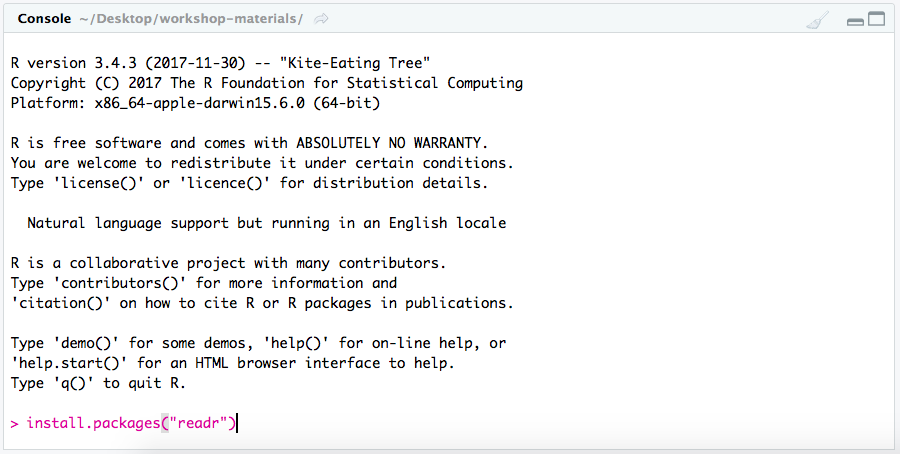
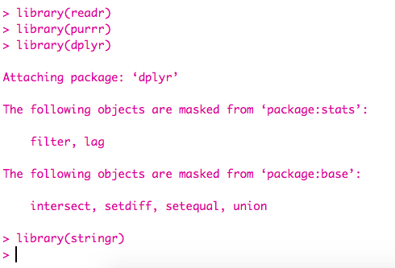

## Getting R and Rstudio

Rstudio helps us to easily run our code, and view the code's results.

- If you don't have R in your computer, download and install R from here: https://cran.case.edu/.

- Then, download and install RStudio Desktop (Open Source Edition - Free) from here: https://www.rstudio.com/products/rstudio/#Desktop.

Now that you have RStudio successfully installed in your computer, let's download important R packages that our code depends on!

## Installing important packages

Code is created using functions. Those functions are available in R packages. In order to successfully run our code, we need to have those packages in R. 

There are some packages that our code depends on. 
- `readr`: to read in data to R
- `purrr`: a complimentary to read in data in our case
- `dplyr`: to summarize data to business level
- `stringr`: to detect string 

To download a package, use function `install.packages("package_to_install")`. Go to Console:



and paste the below codes:

```
install.packages("readr")
install.packages("purrr")
install.packages("dplyr")
install.packages("stringr")
```

It might take sometimes to download these packages, especially `dplyr`. If you run into any errors or trouble, please copy the error message through email for me. 

## Check if packages are successfully installed

You only need to install packages 1 time, and those packages will be in your R system. Let's check if they are installed correctly!

To check this, we use `library(name_of_package)`. In your Console, paste these codes:

```
library(readr)
library(purrr)
library(dplyr)
library(stringr)
```

If everything is successfully installed, you can expect to see no error, like this (some warnings - like I have for `dplyr`, are fine).



Besides checking if packages are installed into R, `library()` is used to load packages before you use any functions that are from those packages. I will mention this further when we see the R code on Wednesday. 