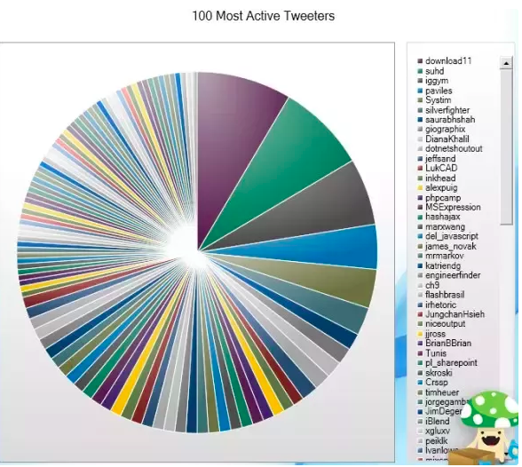

```{r setup, include=FALSE}
library(visdat)
library(tidyverse)
library(gapminder)
```

This workshop acquires some materials from the [Data Wrangling workshop](https://github.com/davidklaing/data_science_workshops) led by David Laing. 

Link to our virtual space: [https://todaysmeet.com/dataviz-workshop](https://todaysmeet.com/dataviz-workshop) 

## How to get set up for this workshop

### Getting R and Rstudio

1. Download and install R from here: [http://cran.stat.sfu.ca/](http://cran.stat.sfu.ca/).
2. Download and install RStudio Desktop (Open Source Edition) from here: [https://www.rstudio.com/products/rstudio/#Desktop](https://www.rstudio.com/products/rstudio/#Desktop).

### Having installation problems?

Option 1: Ask for help! We have volunteers who can help troubleshoot.

Option 2a: Find a partner and follow along together — most of the exercises can be done collaboratively. Your installation problem is almost certainly solvable — we just might not have time today.

Option 2b: Use [this datacamp light](https://cdn.datacamp.com/dcl/standalone-example.html) page to write and execute code in your browser. (A couple caveats: doesn't come with the gapminder data, and might end up distracting you from the lesson. If this is your first time programming, I recommend option 2a.)

### Getting this document on your computer:

1. Go to the GitHub repository here: [https://github.com/hadinh1306/workshop-materials](https://github.com/hadinh1306/workshop-materials)
2. Click the green button on the right that says "Clone or download".
3. Click "Download ZIP". (If you're proficient with git, feel free to clone the repository.)
4. Create a folder on your computer to store your work, and store your ZIP file there.
5. Double-click your ZIP file to unzip it and get all the code.
6, In RStudio, open `data_viz_workshop.Rmd`, a file in `YOUR_FOLDER/workshop_materials/data_visualization`. (That's this file!)

## What will we do today? 

- A quick intro to data visualization (10 mins)
- Discussion about some bad visualizations and how to improve them (10 mins)
- Learn how to make data visualizations using `ggplot2` package (1 hour 30 mins)
- Wrap up and go through bonus if time permits (10 mins)

## Let's get started!

### What is *Data Visualization*? 

Data visualization is a presentation of data in graphical, pictoral format. Why is data visualization so important? 

Besides being able to show the data to others in an engaging way, data visualization is an important task in data science because: 

1. It helps you to understand the structure of your data, and the relationship among each variables that only looking into the dataset at a glance is not possible to tell.

* Example 1: Below I used package `vis_dat` to see structure of the dataset we're working on today - `gapminder`. We'll learn more about this dataset later. Here you can see our dataset has variables in factor, integer, and numeric types. There is some missing data in `lifeExp` variable, which is shown through the grey-colored block. Rest assured, I just made a toy dataset with some missing values to visualize what `vis_dat` can do for you. We will work with a full dataset (no missing values) later!

```{r, echo=FALSE}
test <- gapminder
test$lifeExp[(1000:1250)] <- NA
vis_dat(test, palette = "cb_safe")
```

* Example 2: In this example, I want to discover whether there is any trend between GDP per capita and life expectancy. From the visualization, I can tell indeed there is a positive correlation between the two!

```{r, echo=FALSE}
gapminder %>% 
  ggplot(aes(gdpPercap, lifeExp)) + 
  scale_x_log10() +
  geom_point(alpha = 0.6) + 
  geom_smooth(method = "lm") + 
  labs(title = "Does GDP per capita has any relationship with life expectancy?") + 
  theme_bw()
```

2. It assists you in forming hypothesis for analysis. 

Initially, I thought Asia and Africa are the 2 continents with lowest average GDP per capita. I was wrong! America's average GDP per cap is slightly lower than Asia's. This is because there are some outliers in Asia. 

```{r, echo = FALSE}
gapminder %>% 
  group_by(continent) %>% 
  summarise(avg_GDPpercap = mean(gdpPercap)) %>% 
  ggplot() +
  geom_jitter(data = gapminder, aes(continent, gdpPercap), alpha = 0.3) +
  geom_col(aes(continent, avg_GDPpercap, fill = "average GDP per cap"), color = "red", alpha = 0.4, show.legend = TRUE) + 
  labs(title = "Is GDP per cap generally higher in the western continents?",
       x = "", y = "GDP per cap") + 
  scale_fill_manual(name = "", values = c("average GDP per cap" = "tomato")) + 
  theme_bw()
```

During my time at UBC Master of Data Science program, data visualization is an extremely important component of any project! One of all purposes of data visualization is for exploratory data analysis to understand the structure of our data, limit the scope of our project, and figure out the strategy of how to use this data for a specific analysis (i.e. Do we need further data wrangling?). Another purpose is to compare different models in machine learning to understand their behavior when we change a hyper-parameter - does accuracy goes up or down? We will talk about this in our upcoming workshops in Supervised and Unsupervised Learning! 

Because of all of these reasons, unless we have a super power to understand everything by only looking at the dataset, we would face a great challenge coming up with a good analysis without data visualization. 

### An inspiration!

There are good and bad visualizations. Before we see a good visualization for an inspiration, let's discuss about some bad ones and see how we can improve! 

Bad visualizations cannot convey the message effectively. 



Even worse, it can make viewers misunderstand the story!


Let's see what actually is a good visualization. Hans Rosling's [They Joyful of Stat](https://youtu.be/jbkSRLYSojo?t=33s) is one of my inspirations for data visualization. He turned boring numbers into an engaging story using data visualization! Today we might not re-create his visualization completely, but you will have a taste of how, using R `ggplot2` package.

### Getting ready to play!

In the code snippet below, remove the hashtags from both lines, and click the green "play" button on the right to install `dplyr`, `ggplot2`, and `gapminder`, the three packages you'll need for the workshop.

```{r}
#install.packages("dplyr")
#install.packages("ggplot2")
#install.packages("gapminder")
```

Today, we will work with tabular data - arranged in rows and column, like we did in the [Data Wrangling workshop](https://github.com/davidklaing/data_science_workshops). We are going to learn some fundamental components of `ggplot2` to create a visualization:
- Set up a plot with `ggplot`
- Choose which variables to plot using argument `mapping = aes(x, y)` in `ggplot()`
- Group data using argument `color` or `shape` in `ggplot()`
- Choose which type of plot using `geom_`
- Add title and subtitle using `labels`

Let's load packages that we will use

```{r}
library(dplyr)
library(ggplot2)
library(gapminder)
```

We will work with `gapminder` dataset, which contains data on life expectancy, GDP per capita, and population by country from 1952 to 2007 in increments of 5 years. 

```{r}
head(gapminder)
```

To learn more about the dataset

```{r}
# To see documentation about any object or function in R, prepend it with a 
# question mark and execute that line.
?gapminder
```

### Some quick tips to get our life easier

Review from the Data Wrangling workshop... 

To execute a line of code, move your cursor to that line and then type `Ctrl+Enter`. For example:

```{r}
# Move your cursor to the line below, and type Ctrl-Enter.
print("Welcome to Data Viz workshop!")
```

To assign values to variables, we use `<-` -- quickly get this with `Alt+-`

```{r}
x <- 4
```

Use the pipe `%>%`. This takes the output of the preceding line of code, and passes it in as the first argument of the next line.

```{r}
gapminder %>% 
  select(country, continent) %>% 
  head(5)
```

### Everything starts with a question

Before making any visualization, it's a good practice to have a question in mind. What do you want to know from the dataset? 

In Hans Rosling's visualization, he wanted to see the trend between life span and income of all countries through out the years. We can answer this question using `gapminder` dataset too! In this workshop, let's start from something simple first. 

> What is the trend between life span and income of all countries in the year of 2002? 

There are columns in the dataset that help us to answer this question.

- `country`: 142 countries as factors.
- `continent`: 5 continents as factors. 
- `lifeExp`: life expectancy at birth, in years.
- `gdpPercap`: GDP per capita (US$, inflation-adjusted).

```{r}
df <- gapminder %>% 
  filter(year == 2002)
```

I realize for coding, practicing right after being introduced to a new concept is a great way to learn! Don't be afraid to try out codes by yourself. You can make mistakes but you will learn so much, especially you'll know how to debug if you face that problem again. That being said, we'll have a mini-exercise after each new concept. For the exercises, let's try answering this question:

> What is the trend between population and income of all countries in the year of 2002? 

Besides columns `country`, `continent` and `gdpPercap` described above, we will use column `pop` for population.

### Set up a graph

We always start a visualization with `ggplot()`. This helps us to set up a graph. Notice that we only have a blank space if we only call this function alone! 

In order to set up a graph with axis, we use argument `mapping = aes(x, y)`. To mimic Hans Rosling's graph, I put GDP per cap in x-axis, and life expectancy in y-axis.  

```{r}
# df %>% ggplot()
df %>%
  ggplot(mapping = aes(gdpPercap, lifeExp))
```

When I first learned `ggplot2` for data visualization, I made a little *cheat sheet* to refer to. I find it useful to help me remember all elements of a visualization. Let's build up our cheat sheet!

```
# cheat sheet
<data> %>% 
  ggplot(mapping = aes(x = <variable 1>, y = <variable 2>))
```

#### Mini exercise

Set up a plot with population on x-axis, and GDP per cap on y-axis.

```{r}
# write your code here
```


### Plot it out! 

To make this plot look like the one in Hans Rosling's visualization, we want to use a scatterplot.

```{r}
df %>% 
  ggplot(mapping = aes(x = gdpPercap, y = lifeExp)) + 
  geom_point()
```

While using `ggplot2`, always remember to add each element of a graph using `+` instead of `%>%`.

There are more plot options in `ggplot2` besides scatterplot. 

* `geom_boxplot`: box plot

```{r}
df %>% 
  ggplot(mapping = aes(x = continent, y = lifeExp)) + 
  geom_boxplot()
```

* `geom_bar`: bar chart -- this is quite different from our original thought of a bar chart. `geom_bar` uses number of count for each `x` as `y` values. In order to have bar chart with `y` as a continuous variable, we use `geom_col`.  

```{r}
df %>% 
  ggplot(mapping = aes(x = continent)) + 
  geom_bar()
```

* `geom_hline`: horizontal reference line
* `geom_vline`: vertical reference line

```{r}
df %>% 
  ggplot(mapping = aes(x = gdpPercap, y = lifeExp)) + 
  geom_point() +
  geom_vline(xintercept = mean(df$gdpPercap))
```

When deciding on which types of plots you want to use, remember to consider whether your axis contains discrete or continuous variables. For example, bar chart works nicely when it comes to discrete variable on x-axis (like continent), but does not work for continuous variables (like GDP per cap). Scatterplot, on the other hands, is effective for visualizing continuous variables in both axis.

```
# cheat sheet
<data> %>% 
  ggplot(mapping = aes(x = <variable 1>, y = <variable 2>)) + 
  geom_function()
```

#### Mini exercise 

Visualize population and GDP per cap with a scatterplot.

```{r}
# df %>% 
#   ggplot(mapping = aes(x = pop, y = gdpPercap)) %>% 
  # geom_
```

### Where are the countries?

If you were in the previous workshop, you may think of `group_by`. There is something quite similar in `ggplot2`. 

3 common options are:

- color: group data using different colors
- shape: group data using different shapes
- size: group data using different size

By color:

```{r}
# if there are so many factors in a visualization, this will happen
df %>% 
  ggplot(mapping = aes(x = gdpPercap, y = lifeExp, color = country)) + 
  geom_point()
```

Instead, let's color by continent.

```{r}
df %>% 
  ggplot(mapping = aes(x = gdpPercap, y = lifeExp, color = continent)) + 
  geom_point()
```

By shape: 

```{r}
df %>% 
  ggplot(mapping = aes(x = gdpPercap, y = lifeExp, shape = continent)) + 
  geom_point()
```

By size:

Notice that we some overlapping dots here. We can adjust this by setting the level of transparency - `alpha`. The closer `alpha` is to 1, the less transparent (or more in full color) our plot is.

```{r}
df %>% 
  ggplot(mapping = aes(x = gdpPercap, y = lifeExp, size = gdpPercap)) + 
  geom_point() #alpha = 0.5)
```

We can try grouping data using several methods at once! 

```{r}
df %>% 
  ggplot(mapping = aes(x = gdpPercap, y = lifeExp, color = continent, size = lifeExp)) + 
  geom_point(alpha = 0.5)
```

```
# cheat sheet
<data> %>% 
  ggplot(mapping = aes(x = <variable>, y = <variable>, 
                       color = <variable>, shape = <variable>, size = <variable>)) + 
  geom_function(alpha = <level of transparency>)
```

#### Mini exercise

Modify your code in the previous exercise to add continent into the visualization, and group population by size. Feel free to play with the different options of grouping or level of alpha. 

```{r}
# df %>% 
#   ggplot(mapping = aes(x = pop, y = gdpPercap)) %>% 
#   geom_point()
```

We made it - a basic Hans Rosling graph! 

However, for a person who does not know what question we want to answer using this visualization , our axis labels are not so informative. 

### Let's fix data labels!

I generally set everything at once using `labs`. 

Label options:
- x-axis
- y-axis
- title 
- subtitle
- caption

```{r}
df %>% 
  ggplot(mapping = aes(x = gdpPercap, y = lifeExp, color = continent, size = lifeExp)) + 
  geom_point(alpha = 0.5) + 
  labs(title = "Life expectancy and GDP per capita", subtitle = "Of all countries in 2002",
       caption = "Inspired by Hans Rosling", 
       x = "GDP per capita ($)", y = "Life expectancy (years)")
```

```
# cheat sheet
<data> %>% 
  ggplot(mapping = aes(x = <variable>, y = <variable>, 
                       color = <variable>, shape = <variable>, size = <variable>)) + 
  geom_function(alpha = <level of transparency>) + 
  labs(title = "<text>", subtitle = "<text>", caption = "<text>",
       x = "<text>", y = "<text>")
```

#### Mini exercise

Add title(s) and modify axis labels of your visualization.

```{r}
# df %>% 
#   ggplot(mapping = aes(x = pop, y = gdpPercap, color = continent, size = gdpPercap)) %>% 
#   geom_point(alpha = 0.5) + 
```

### [Bonus] How about those legend titles?

Depending on our settings in `aes()`, we choose which `scale_` function to use for changing legend titles. 
In this visualization, `continent` is a discrete variable grouped using `color`, and `lifeExp` is a continuous variable grouped using `size`. We use `scale_color_discrete` for `continent`, and `scale_size_continuous` for `lifeExp`.

```{r}
df %>% 
  ggplot(mapping = aes(x = gdpPercap, y = lifeExp, color = continent, size = lifeExp)) + 
  geom_point(alpha = 0.5) + 
  labs(title = "Life expectancy and GDP per capita", subtitle = "Of all countries in 2002",
       caption = "Inspired by Hans Rosling", 
       x = "GDP per capita ($)", y = "Life expectancy (years)") + 
  scale_color_discrete(name = "") + 
  scale_size_continuous(name = "GDP per capita")
```

```
# cheat sheet
<data> %>% 
  ggplot(mapping = aes(x = <variable>, y = <variable>, 
                       color = <variable>, shape = <variable>, size = <variable>)) + 
  geom_function(alpha = <level of transparency>) + 
  labs(title = "<text>", subtitle = "<text>", caption = "<text>",
       x = "<text>", y = "<text>") + 
  scale_function(name = "<text>")
```

#### Mini exercise

Add labels for your legend. 

```{r}

```


### [Bonus] Facetting

If the number of discrete groups are not a lot, you can consider spreading data into different windows using `facet_wrap`. Each window contains visualization for each group.

```{r}
df %>% 
  ggplot(mapping = aes(x = gdpPercap, y = lifeExp, color = continent, size = lifeExp)) + 
  geom_point(alpha = 0.5) + 
  labs(title = "Life expectancy and GDP per capita", subtitle = "Of all countries in 2002",
       caption = "Inspired by Hans Rosling", 
       x = "GDP per capita ($)", y = "Life expectancy (years)") + 
  scale_color_discrete(name = "") +
  scale_size_continuous(name = "GDP per capita") +
  facet_wrap(~continent) #scales = "free")
```

```
# cheat sheet
<data> %>% 
  ggplot(mapping = aes(x = <variable>, y = <variable>, 
                       color = <variable>, shape = <variable>, size = <variable>)) + 
  geom_function(alpha = <level of transparency>) + 
  labs(title = "<text>", subtitle = "<text>", caption = "<text>",
       x = "<text>", y = "<text>") + 
  scale_function(name = "<text>") + 
  facet_wrap(~<variable to facet>)
```

#### Mini exercise

Use `facet` to have separated visualization for each continent 

```{r}

```


