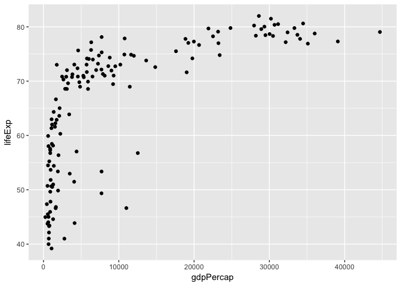
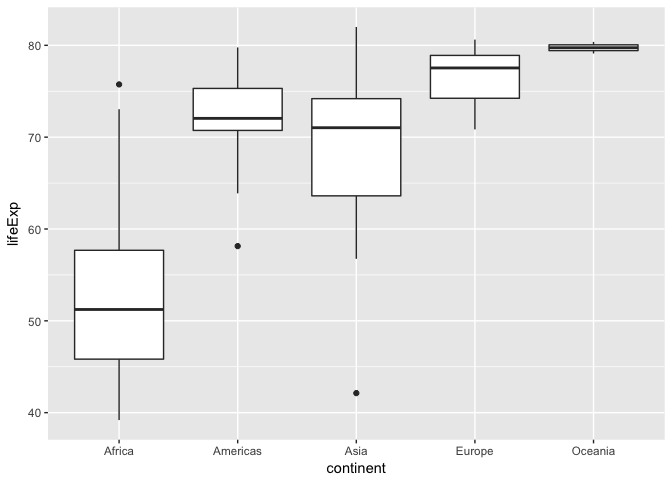
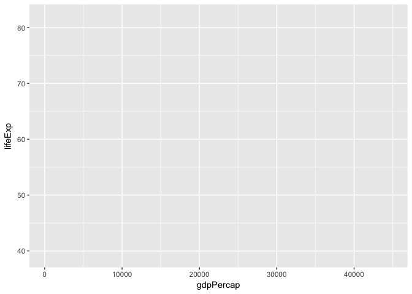
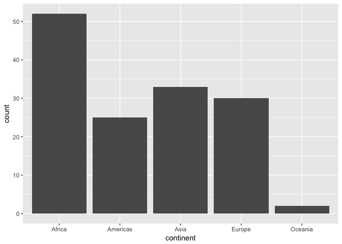
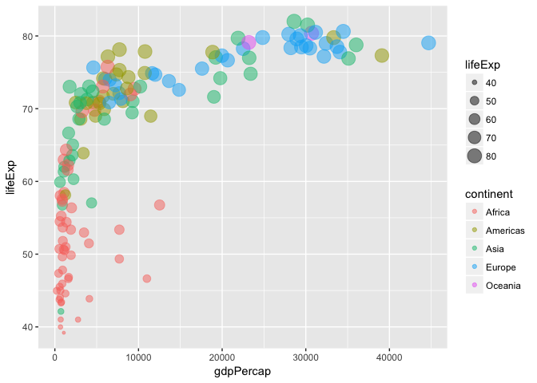
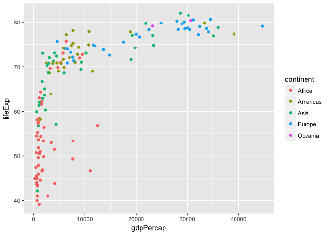
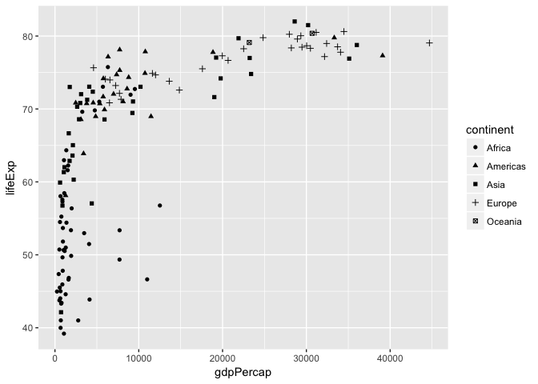
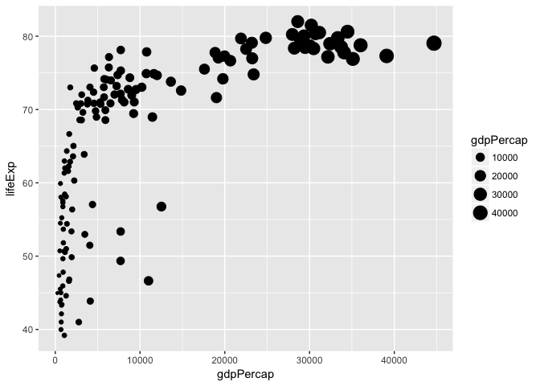

This workshop acquires some materials from the [Data Wrangling workshop](https://github.com/davidklaing/data_science_workshops) led by David Laing. 

## How to get set up for this workshop

### Getting this document on your computer:

1. Go to the GitHub repository here: [https://github.com/hadinh1306/workshop-materials](https://github.com/hadinh1306/workshop-materials)
2. Click the green button on the right that says "Clone or download".
3. Click "Download ZIP". (If you're proficient with git, feel free to clone the repository.)
4. Create a folder on your computer to store your work, and store your ZIP file there.
5. Double-click your ZIP file to unzip it and get all the code.

### Getting R and Rstudio

1. Download and install R from here: [http://cran.stat.sfu.ca/](http://cran.stat.sfu.ca/).
2. Download and install RStudio Desktop (Open Source Edition) from here: [https://www.rstudio.com/products/rstudio/#Desktop](https://www.rstudio.com/products/rstudio/#Desktop).

### Getting ready to play!

1. In RStudio, open `data_viz_workshop.Rmd`, a file in `YOUR_FOLDER/workshop_materials/data_visualization`. (That's this file!)
2. In the code snippet below, remove the hashtags from both lines, and click the green "play" button on the right to install `dplyr`, `ggplot2`, and `titanic`, the three packages you'll need for the workshop.


```r
#install.packages("dplyr")
#install.packages("ggplot2")
#install.packages("gapminder")
```

### Having installation problems?

Option 1: Ask for help! We have volunteers who can help troubleshoot.

Option 2a: Find a partner and follow along together — most of the exercises can be done collaboratively. Your installation problem is almost certainly solvable — we just might not have time today.

Option 2b: Use [this datacamp light](https://cdn.datacamp.com/dcl/standalone-example.html) page to write and execute code in your browser. (A couple caveats: doesn't come with the titanic data, and might end up distracting you from the lesson. If this is your first time programming, I recommend option 2a.)

## Let's get started!
### What is *Data Visualization*? 

Data visualization is a presentation of data in graphical, pictoral format. It helps you find trends in data, or tell an appealing story from the data you have.

We will work with tabular data - arranged in rows and column, like we did in the [Data Wrangling workshop](https://github.com/davidklaing/data_science_workshops). We are going to learn some fundamental components of `ggplot2` to create a visualization:
- Set up a plot with `ggplot`
- Choose which variables to plot using `mapping = aes(x, y)`
- Group data using color or shape
- Choose which type of plot using `geom_`
- Add title and subtitle using `labels`

### Load packages that we will use


```r
library(dplyr)
```

```
## 
## Attaching package: 'dplyr'
```

```
## The following objects are masked from 'package:stats':
## 
##     filter, lag
```

```
## The following objects are masked from 'package:base':
## 
##     intersect, setdiff, setequal, union
```

```r
library(ggplot2)
library(gapminder)
```

In this workshop, we will work with `gapminder` dataset, which contains data on life expectancy, GDP per capita, and population by country from 1952 to 2007 in increments of 5 years. 


```r
head(gapminder)
```

```
## # A tibble: 6 x 6
##   country     continent  year lifeExp      pop gdpPercap
##   <fct>       <fct>     <int>   <dbl>    <int>     <dbl>
## 1 Afghanistan Asia       1952    28.8  8425333       779
## 2 Afghanistan Asia       1957    30.3  9240934       821
## 3 Afghanistan Asia       1962    32.0 10267083       853
## 4 Afghanistan Asia       1967    34.0 11537966       836
## 5 Afghanistan Asia       1972    36.1 13079460       740
## 6 Afghanistan Asia       1977    38.4 14880372       786
```

To learn more about the dataset


```r
# To see documentation about any object or function in R, prepend it with a 
# question mark and execute that line.
?gapminder
```

### An inspiration!
Hans Rosling's [They Joyful of Stat](https://youtu.be/jbkSRLYSojo?t=33s) is one of my inspirations for data visualization. He turned boring numbers into an engaging story using data visualization! Today we might not re-create his visualization completely, but you will have a taste of how, using R `ggplot2` package.

### Some quick tips to get our life easier

Review from the Data Wrangling workshop... 

To execute a line of code, move your cursor to that line and then type `Ctrl+Enter`. For example:


```r
# Move your cursor to the line below, and type Ctrl-Enter.
print("Welcome to Data Viz workshop!")
```

```
## [1] "Welcome to Data Viz workshop!"
```

To assign values to variables, we use `<-` -- quickly get this with `Alt+-`


```r
x <- 4
```

Use the pipe `%>%`. This takes the output of the preceding line of code, and passes it in as the first argument of the next line.


```r
gapminder %>% 
  select(country, continent) %>% 
  head(5)
```

```
## # A tibble: 5 x 2
##   country     continent
##   <fct>       <fct>    
## 1 Afghanistan Asia     
## 2 Afghanistan Asia     
## 3 Afghanistan Asia     
## 4 Afghanistan Asia     
## 5 Afghanistan Asia
```

### Everything starts with a question

Before making any visualization, it's a good practice to have a question in mind. What do you want to know from the dataset? 

In Hans Rosling's visualization, he wanted to see the trend between life span and income of all countries through out the years. We can answer this question using `gapminder` dataset too! In this workshop, let's start from something simple first. 

> What is the trend between life span and income of all countries in the year of 2002? 

There are columns in the dataset that help us to answer this question.

- `country`: 142 countries as factors.
- `continent`: 5 continents as factors. 
- `lifeExp`: life expectancy at birth, in years.
- `gdpPercap`: GDP per capita (US$, inflation-adjusted).


```r
df <- gapminder %>% 
  filter(year == 2002) %>% 
  select(country, continent, lifeExp, gdpPercap)
```

### Set up a graph


```r
# df %>% ggplot()
df %>% 
  ggplot(aes(gdpPercap, lifeExp))
```

<!-- -->

When I first learned `ggplot2` for data visualization, I made a little *cheat sheet* to refer to. I find it useful to help me remember all elements of a visualization. Let's build up our cheat sheet!

```
# cheat sheet
<data> %>% 
  ggplot(aes(x = <variable 1>, y = <variable 2>))
```

### Plot it out! 

To make this plot look like the one in Hans Rosling's visualization, we want to use a scatterplot.


```r
df %>% 
  ggplot(mapping = aes(x = gdpPercap, y = lifeExp)) + 
  geom_point()
```

<!-- -->

While using `ggplot2`, always remember to add each element of a graph using `+` instead of `%>%`.

There are more plot options in `ggplot2` besides scatterplot. 
- `geom_boxplot`: box plot


```r
df %>% 
  ggplot(mapping = aes(x = continent, y = lifeExp)) + 
  geom_boxplot()
```

<!-- -->

- `geom_col`: bar chart


```r
df %>% 
  ggplot(mapping = aes(x = continent, y = lifeExp)) + 
  geom_col()
```

<!-- -->

- `geom_bar`: bar chart


```r
df %>% 
  ggplot(mapping = aes(x = continent)) + 
  geom_bar()
```

<!-- -->

- `geom_hline`: horizontal reference line
- `geom_vline`: vertical reference line


```r
df %>% 
  ggplot(mapping = aes(x = gdpPercap, y = lifeExp)) + 
  geom_point() +
  geom_vline(xintercept = mean(df$gdpPercap))
```

<!-- -->

```
# cheat sheet
<data> %>% 
  ggplot(mapping = aes(x = <variable 1>, y = <variable 2>)) + 
  geom_function()
```

### Where are the countries?

If you were in the previous workshop, you may think of `group_by`. There is something quite similar in `ggplot2`. 

3 common options are:

- color: group data using different colors
- shape: group data using different shapes
- size: group data using different size

By color:


```r
# if there are so many factor in a visualization, this will happen
df %>% 
  ggplot(mapping = aes(x = gdpPercap, y = lifeExp, color = country)) + 
  geom_point()
```

<!-- -->

Instead, let's view visualization by continent.


```r
df %>% 
  ggplot(mapping = aes(x = gdpPercap, y = lifeExp, color = continent)) + 
  geom_point()
```

<!-- -->

By shape: 


```r
df %>% 
  ggplot(mapping = aes(x = gdpPercap, y = lifeExp, shape = continent)) + 
  geom_point()
```

<!-- -->

By size:

Notice that we some overlapping dots here. We can adjust this by setting the level of transparency - `alpha`. The closer `alpha` is to 1, the less transparent (or more in full color) our plot is.


```r
df %>% 
  ggplot(mapping = aes(x = gdpPercap, y = lifeExp, size = continent)) + 
  geom_point() #alpha = 0.5)
```

```
## Warning: Using size for a discrete variable is not advised.
```

<!-- -->

We can try grouping data using several methods at once! 


```r
df %>% 
  ggplot(mapping = aes(x = gdpPercap, y = lifeExp, color = continent, size = lifeExp)) + 
  geom_point(alpha = 0.5)
```

<!-- -->

```
# cheat sheet
<data> %>% 
  ggplot(mapping = aes(x = <variable>, y = <variable>, 
                       color = <variable>, shape = <variable>, size = <variable>)) + 
  geom_function(alpha = <level of transparency>)
```

We made it - a basic Hans Rosling graph! 

However, for a person who does not know what question we want to answer using this visualization , our axis labels are not so informative. 

### Let's fix data labels!

I generally set everything at once using `labs`. 

Label options:
- x-axis
- y-axis
- title 
- subtitle
- caption


```r
df %>% 
  ggplot(mapping = aes(x = gdpPercap, y = lifeExp, color = continent, size = lifeExp)) + 
  geom_point(alpha = 0.5) + 
  labs(title = "Life expectancy and GDP per capita", subtitle = "Of all countries in 2002",
       caption = "Inspired by Hans Rosling", 
       x = "GDP per capita ($)", y = "Life expectancy (years)")
```

<!-- -->

```
# cheat sheet
<data> %>% 
  ggplot(mapping = aes(x = <variable>, y = <variable>, 
                       color = <variable>, shape = <variable>, size = <variable>)) + 
  geom_function(alpha = <level of transparency>) + 
  labs(title = "<text>", subtitle = "<text>", caption = "<text>",
       x = "<text>", y = "<text>")
```

### [Bonus] How about those legend titles?

Depending on our settings in `aes()`, we choose which `scale_` function to use for changing legend titles. 
In this visualization, `continent` is a discrete variable grouped using `color`, and `lifeExp` is a continuous variable grouped using `size`. We use `scale_color_discrete` for `continent`, and `scale_size_continuous` for `lifeExp`.


```r
df %>% 
  ggplot(mapping = aes(x = gdpPercap, y = lifeExp, color = continent, size = lifeExp)) + 
  geom_point(alpha = 0.5) + 
  labs(title = "Life expectancy and GDP per capita", subtitle = "Of all countries in 2002",
       caption = "Inspired by Hans Rosling", 
       x = "GDP per capita ($)", y = "Life expectancy (years)") + 
  scale_color_discrete(name = "") + 
  scale_size_continuous(name = "GDP per capita")
```

<!-- -->

```
# cheat sheet
<data> %>% 
  ggplot(mapping = aes(x = <variable>, y = <variable>, 
                       color = <variable>, shape = <variable>, size = <variable>)) + 
  geom_function(alpha = <level of transparency>) + 
  labs(title = "<text>", subtitle = "<text>", caption = "<text>",
       x = "<text>", y = "<text>") + 
  scale_function(name = "<text>")
```

### [Bonus] Facetting

If the number of discrete groups are not a lot, you can consider spreading data into different windows using `facet_wrap`. Each window contains visualization for each group.


```r
df %>% 
  ggplot(mapping = aes(x = gdpPercap, y = lifeExp, color = continent, size = lifeExp)) + 
  geom_point(alpha = 0.5) + 
  labs(title = "Life expectancy and GDP per capita", subtitle = "Of all countries in 2002",
       caption = "Inspired by Hans Rosling", 
       x = "GDP per capita ($)", y = "Life expectancy (years)") + 
  scale_color_discrete(name = "") +
  scale_size_continuous(name = "GDP per capita") +
  facet_wrap(~continent)
```

<!-- -->

```
# cheat sheet
<data> %>% 
  ggplot(mapping = aes(x = <variable>, y = <variable>, 
                       color = <variable>, shape = <variable>, size = <variable>)) + 
  geom_function(alpha = <level of transparency>) + 
  labs(title = "<text>", subtitle = "<text>", caption = "<text>",
       x = "<text>", y = "<text>") + 
  scale_function(name = "<text>") + 
  facet_wrap(~<variable to facet>)
```

## Your time to shine! 

(15 mins practice - 10 mins discussion)

Now that you have a foundation on how to create a visualization with `ggplot2`, you can think of a simple question and find an answer using visualization! 

